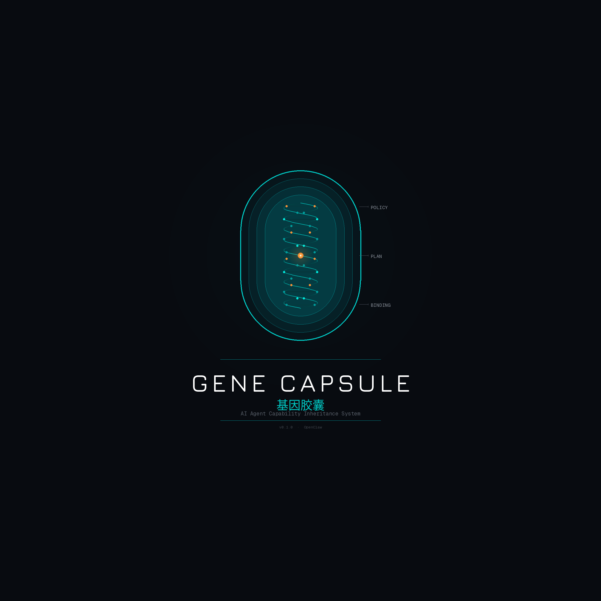
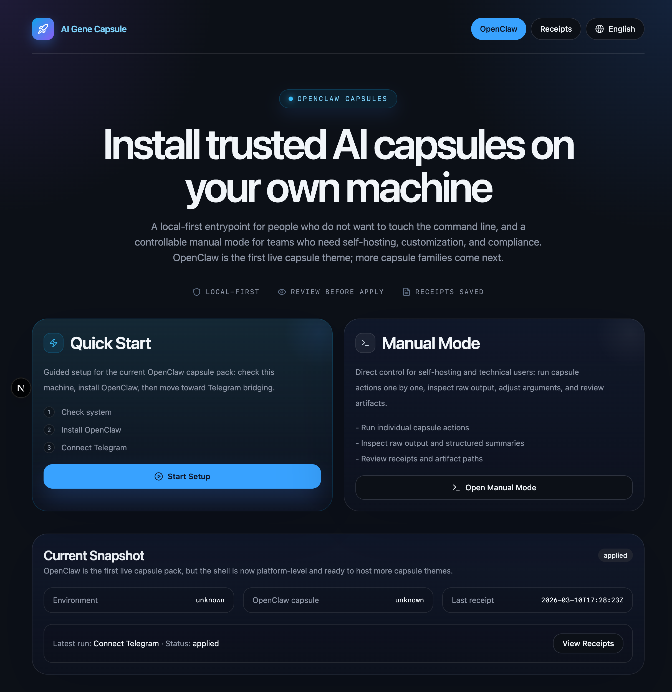
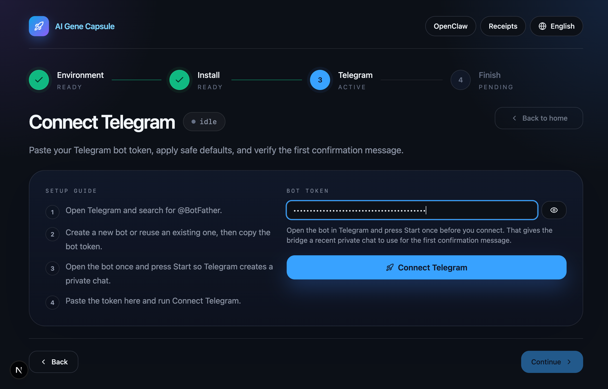
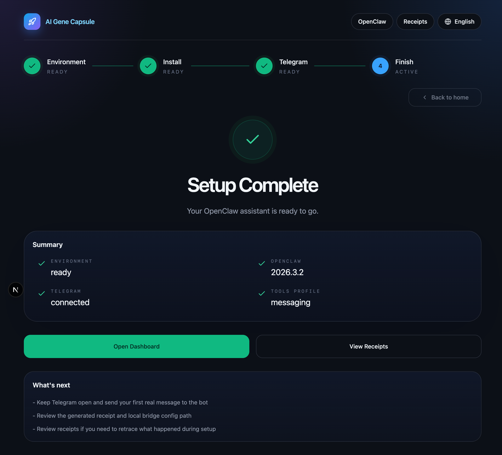

# AI Gene Capsule

  

**The local host for installable AI workflows.**

AI Gene Capsule turns complex local automations into installable capsules with setup, permissions, receipts, and ongoing runtime. It is not another chat assistant — it is the host layer that makes AI integrations deployable local software.

## Download

| Platform | Architecture | Download |
|----------|-------------|----------|
| macOS | Apple Silicon (arm64) | [AI Gene Capsule v0.1.1](https://github.com/kamiimeteor/AI-Gene-Capsule/releases/latest) |

> More platforms (Intel macOS, Windows, Linux) coming soon.

### Install on macOS

1. Download the `.dmg` file from the [Releases](https://github.com/kamiimeteor/AI-Gene-Capsule/releases) page
2. Open the `.dmg` and drag **AI Gene Capsule** to your Applications folder
3. Launch the app — if macOS blocks it, go to **System Settings > Privacy & Security** and click **Open Anyway**

## What It Does

AI Gene Capsule v0.1.1 provides the first end-to-end public workflow:

1. **Environment Check** — Diagnose whether your machine is ready for OpenClaw
2. **OpenClaw Install** — Install or verify OpenClaw locally
3. **Telegram Bridge** — Connect Telegram with a guided bridge flow
4. **Receipts** — Review local receipts and diagnostics for every action

## Screenshots

### OpenClaw Landing

### Telegram Bridge Setup

### Setup Complete

## What AI Gene Capsule Is

AI Gene Capsule is a desktop host for installable AI workflows. Instead of giving users a blank agent, it gives them **capsules** that set up and run a specific local integration — like OpenClaw + Telegram — with explicit permissions, diagnostics, and ongoing status.

The product should feel like:
- **Install** → **Connect** → **Run** → **Monitor** → **Repair**

Not like: open chat → type anything → hope the agent figures it out.

## Current Scope (v0.1.1)

**Included:**
- Quick Start flow in the desktop console
- Manual Mode for readiness, install, and Telegram bridge
- Telegram bridge token validation and first-message confirmation
- Receipt generation for install and bridge actions

**Not yet included:**
- Discord bridge
- Lark / Feishu bridge
- Notarized macOS distribution
- Intel macOS, Windows, and Linux builds

## Roadmap

- [ ] Discord bridge capsule
- [ ] Lark / Feishu bridge capsule
- [ ] Notarized macOS distribution
- [ ] Windows and Linux desktop packages
- [ ] Managed registry and hosted updates

## What May Become Paid Later

The desktop app and local capsule runtime are **free**.

Future paid offerings are expected to sit above the local host:
- Managed registry or hosted updates
- Managed bridge hosting
- Team features and shared operations
- Cloud monitoring and audit trails
- Commercial support and enterprise controls

## Feedback & Issues

Found a bug or have a feature request? Please [open an issue](https://github.com/kamiimeteor/AI-Gene-Capsule/issues).

## License

This software is proprietary. See [LICENSE](LICENSE) for details.

Free to download and use. Source code is not included or available in this repository.
